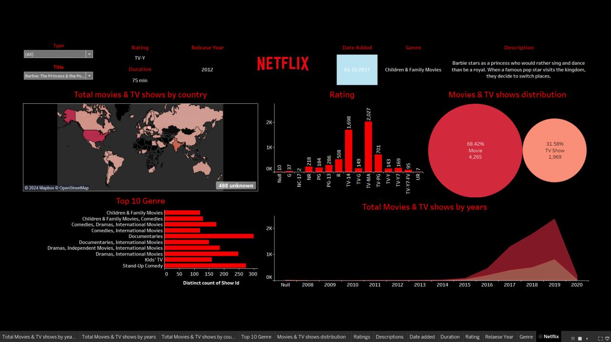

# 🎬 Netflix Content Trends Analysis

A Power BI dashboard exploring Netflix's content catalog — analyzing the mix of movies vs. TV shows, genre popularity, content ratings, and catalog growth over time and by country.

## 📊 What's Inside
- **Movies & TV Shows Distribution** — breakdown of catalog composition (68.4% Movies, 31.6% TV Shows)
- **Total Movies & TV Shows by Country** — geographic spread of content on a world map
- **Total Movies & TV Shows by Year** — catalog growth trend from pre-2010 to 2020
- **Top 10 Genres** — most common content categories (Documentaries, Dramas, Comedies, Kids' TV, etc.)
- **Rating Distribution** — breakdown across TV-MA, TV-14, TV-PG, R, PG-13, and other rating categories
- Interactive filters by **Type** and **Title**, with detail view (release year, duration, date added, genre, description) for any selected title

## 🛠 Tools Used
Power BI, Power Query, DAX

## 📈 Key Insights
- Netflix's catalog is majority Movies (68%) over TV Shows (32%)
- Content additions grew sharply after 2015, peaking around 2019-2020
- **Documentaries** and **Dramas** dominate as the most represented genres
- **TV-MA** and **TV-14** are the most common content ratings, indicating a catalog skewed toward mature/teen audiences

## 📁 Files
- `netflix.png` — dashboard screenshot
- *(add your `.pbix` file here if you'd like to upload it)*

## 🔗 Contact
📧 fernandesclancy17@gmail.com
💼 [linkedin.com/in/clancyfernandes](https://linkedin.com/in/clancyfernandes)
